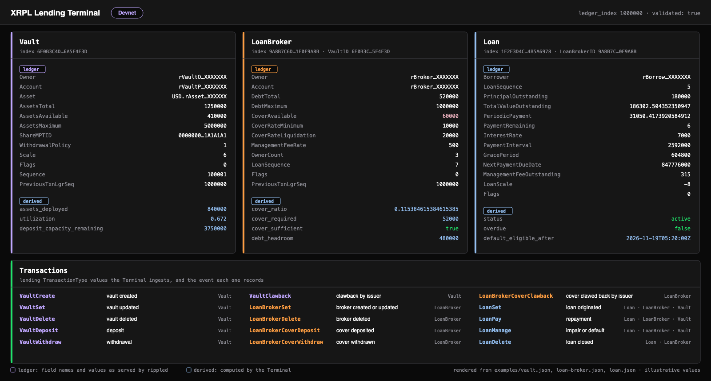

# XRPL Lending Terminal

Market data and analytics infrastructure for the XRP Ledger Lending Protocol.

Developed by [XRPL Lending Network](https://github.com/XRPL-Lending-Network).

> **Status:** under active development against the XRPL Lending Devnet.
> The underlying protocol specifications, [XLS-65](https://github.com/XRPLF/XRPL-Standards/tree/master/XLS-0065-single-asset-vault)
> and [XLS-66](https://github.com/XRPLF/XRPL-Standards/tree/master/XLS-0066-lending-protocol),
> are Draft standards and their interfaces may change. See [Development Status](docs/development-status.md).

This repository is the public technical overview of the Terminal. It documents
what the Terminal consumes from the ledger, how that information is structured,
and what it presents. The production implementation (indexing, analytics engine,
internal APIs) is not published here.



## Overview

The XRP Ledger Lending Protocol introduces native lending objects to the ledger:
Single Asset Vaults that pool depositor capital, Loan Brokers that draw on that
capital and post first-loss cover, and Loans that record fixed-term credit
agreements between a broker and a borrower. Every deposit, loan origination, repayment,
impairment and default is a ledger transaction that updates these objects.

On its own, this is ledger state: individual objects, individual transactions,
and per-account directories. The XRPL Lending Terminal turns that ledger-level
information into structured lending market data:

- a consistent, queryable view of every vault, broker and loan;
- the history of how each of them changed;
- derived metrics such as utilization, capacity and cover ratios;
- aggregates across vaults, assets and the protocol as a whole.

The result feeds the XRPL Lending Network market interface.

```
XRP Ledger Lending Protocol  →  XRPL Lending Terminal  →  XRPL Lending Network market interface
```

## Architecture

The Terminal is organised as a pipeline from protocol state to presentation.

```
XRP Ledger
  → Single Asset Vaults / Loan Brokers / Loans / Transactions
    → Data Ingestion
      → Normalization
        → Market State
          → Analytics
            → XRPL Lending Terminal
```

| Stage | Responsibility |
|---|---|
| **XRP Ledger** | Source of truth. Vault, LoanBroker and Loan ledger entries plus the transactions that create and modify them. |
| **Data Ingestion** | Reads validated ledgers and the lending objects and transactions they contain. |
| **Normalization** | Maps raw ledger entries and transaction metadata onto a stable lending data model with consistent units, timestamps and identifiers. |
| **Market State** | Maintains the current state of every vault, broker and loan, together with its change history. |
| **Analytics** | Computes derived metrics and market-level aggregates on top of market state. |
| **XRPL Lending Terminal** | Presents market state and analytics to users. |

The full description is in [docs/architecture.md](docs/architecture.md).
This page intentionally describes the stages and their boundaries, not how
they are implemented.

## Protocol Coverage

The Terminal is being developed against the current XRPL Lending Protocol
implementation. Target coverage:

- **Single Asset Vaults** (XLS-65): vault state, deposits, withdrawals, clawbacks, share tokens
- **Loan Brokers** (XLS-66): broker configuration, debt tracking, management fees
- **Loans** (XLS-66): loan terms, schedule, outstanding balances
- **Loan repayments**: scheduled, late, early full and overpayments
- **First-loss capital / cover**: deposits, withdrawals, clawbacks, liquidation on default
- **Impairment and default state**: impairment, un-impairment, default
- **Relevant lending transactions**: the Vault*, LoanBroker* and Loan* transaction families

Details, including which ledger fields and flags map to which Terminal
concepts, are in [docs/protocol-coverage.md](docs/protocol-coverage.md).

## Market Data

The Terminal is designed to provide the following categories of information.

**Direct ledger data.** Read from Vault, LoanBroker and Loan entries and the
transactions that modify them. The Terminal structures and indexes this data
but does not change its meaning.

| Category | Examples |
|---|---|
| Vault state | asset, total assets, available assets, maximum assets, unrealized loss, share token, withdrawal policy |
| Loan Broker state | linked vault, debt total, debt maximum, cover available, cover rate minimum, cover rate liquidation, management fee rate, loan count |
| Outstanding debt | principal outstanding, total value outstanding, management fee outstanding per loan; debt total per broker |
| First-loss cover | cover available per broker; cover deposits, withdrawals and clawbacks |
| Active loans | borrower, principal, interest rate, payment schedule, next payment due date, remaining payments |
| Repayment activity | LoanPay transactions, payment type (scheduled, late, full, overpayment) |
| Impairment / default state | Loan flags and the LoanManage transactions that set or clear them |
| Protocol activity | the stream of lending transactions across the ledger |

**Metrics derived by the Terminal.** Computed from the data above. These are
Terminal outputs, not ledger fields.

| Category | Examples |
|---|---|
| Lending capacity | how much a vault or broker can still lend given vault liquidity and broker limits |
| Utilization | share of pooled capital currently deployed in loans, per vault and per asset |
| Cover ratios | first-loss cover relative to outstanding debt and to required minimums |
| Repayment metrics | on-time versus late payment behaviour, remaining schedule value |
| Market-level aggregates | totals and distributions across vaults, brokers, assets and the whole protocol |
| Change history | how any of the above evolved over time |

The data model is described in [docs/data-model.md](docs/data-model.md).
Sanitized examples of the general shape of vault, broker and loan data are in
[examples/](examples/).

## Development Status

- Development currently targets the **XRPL Lending Devnet**.
- **XLS-65** (Single Asset Vault) and **XLS-66** (Lending Protocol) are currently
  **Draft** specifications. Ledger entry fields, flags and transaction types may change,
  and the Terminal's data model will follow those changes.
- The Lending Protocol is **not** available on XRPL Mainnet at the time of writing.
  Nothing in this repository should be read as a statement of Mainnet availability.

See [docs/development-status.md](docs/development-status.md).

## What this repository is and is not

This repository **is** a technical overview of a real product under development
by XRPL Lending Network.

It **is not**:

- an official XRP Ledger Foundation project;
- a replacement for the XRPL documentation or the XLS specifications;
- a demo or reference implementation of XLS-65 / XLS-66;
- the open-source production Terminal. The production implementation is private.

## References

- [XRPL Lending Protocol documentation](https://xrpl.org/docs/concepts/tokens/lending-protocol)
- [XRPL Single Asset Vault documentation](https://xrpl.org/docs/concepts/tokens/single-asset-vaults)
- [XLS-65: Single Asset Vault](https://github.com/XRPLF/XRPL-Standards/tree/master/XLS-0065-single-asset-vault)
- [XLS-66: Lending Protocol](https://github.com/XRPLF/XRPL-Standards/tree/master/XLS-0066-lending-protocol)
- [XRPL Lending Network](https://github.com/XRPL-Lending-Network)

## Contributing

Corrections to the documentation and example data are welcome. See
[CONTRIBUTING.md](CONTRIBUTING.md) for what fits this repository and how the
example data is kept synthetic.

## Security

Please report security issues as described in [SECURITY.md](SECURITY.md).

## License

Copyright XRPL Lending Network. Documentation, diagrams and examples in this
repository are licensed under the [Apache License 2.0](LICENSE).
